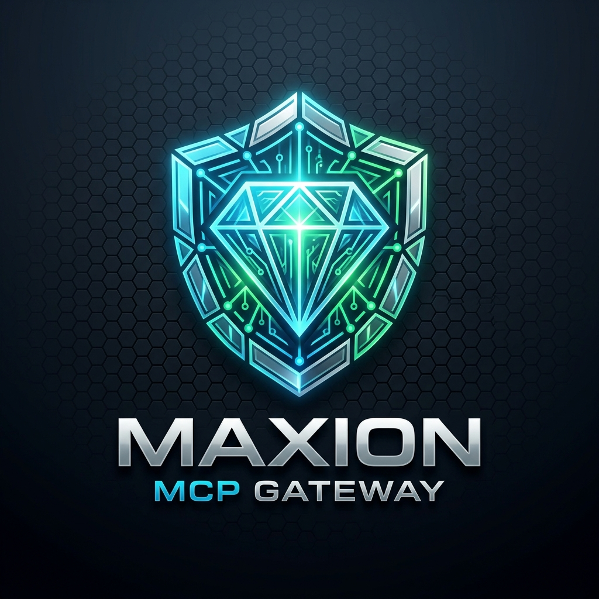

# Maxion V16 - Speed up your agents while using less tokens, and compute 70,000x faster with nano second processin. Using 70-86% less energy, saving resources/money, while preventing wasteful heat generation, amd thermal hardware degredation, maximizing your hardware life! 
# Quezar Storage - Store more, for less. Quicker. Your local Quezar vault has extreme compression abilities with nano second injection/retrieval speeds. The fastest architecture on the market, built for any operating system. Increasing your storage space exponentially, cloud free!
# Diamonize LSA - Secure your data easier, faster, and more secure than ever! This powerhouse of an engine has the strongest, quickest, most unbreakable security engine on the market! Never worry about the outside world invading your data again! 
<p align="center">
  
</p>

<p align="center">
  
</p>

[](https://github.com/aruuhii2yo/maxion-mcp/actions)
[](https://github.com/marketplace/actions/maxion-ai-security-energy-governor)
[](https://smithery.ai/server/aruuhii2yo/maxion-mcp)
[](https://github.com/aruuhii2yo/maxion-mcp/releases)
[](LICENSE)
[](https://modelcontextprotocol.io)

> **Every unconstrained AI agent loop is a power bill waiting to happen.** Maxion fixes that — and protects your machine while it does.

Maxion is a zero-trust MCP gateway and GitHub Action that gives your AI agents autonomous compute pacing, real-time threat interception, and AES-256-GCM encrypted state vaulting — all running in-process in under 50 microseconds.

---

## ⚡ The Energy Problem Nobody Talks About

When you leave an AI agent running overnight, it pushes your CPU to 100% thermal saturation. Your fan screams. Your laptop throttles. Your cloud bill spikes. Your SSD wears out faster from log bloat.

Maxion solves all of it:

- **Autonomous Thermal Governor** — dynamically paces compute to keep your processor in its peak energy-efficiency window. No more jet-engine fan noise. No more thermal throttling mid-task.
- **99.7% Storage Compaction** — Quezar compresses telemetry logs up to 342x with pre-trained Zstandard dictionaries. A 100 MB session trace shrinks to under 300 KB. Slashes SSD write amplification and I/O power draw.
- **Wire-Speed Execution (<50 µs)** — runs entirely in-process. Zero network hops. Zero cloud API roundtrips. Zero energy wasted on guardrail latency.
- **Instant Cryptographic Shredding** — purge a vault sector instantly without slow, wear-inducing multi-pass disk wiping.

---

## The Results You Get

- **Prompt Injection Defense** — catches and neutralizes malicious prompt injection before it manipulates your tools
- **Rogue Command Prevention** — blocks unauthorized shell commands and destructive disk operations before execution
- **24/7 Hardware & Energy Protection** — autonomous thermal pacing prevents overheating, fan roar, and excessive power draw during long agent runs
- **Local Encrypted Vaulting** — API keys and session memories hardware-sealed where agents cannot leak them
- **High-Density Storage Compaction** — up to **342x compression ratio**, up to **99.7% disk I/O reduction**
- **Wire-Speed Execution (<50 µs)** — zero perceptible latency added to streaming token responses
- **Frictionless MCP Setup** — works out of the box with Claude Desktop, Cursor, Windsurf, or any MCP-compatible client

---

## ⚡ Empirical Performance & Energy Efficiency

### In-Process Wire-Speed Latency (<50 Microseconds)
* **Cloud Guardrail APIs** (AWS Bedrock, Azure AI Content Safety): **150ms – 350ms per tool call** — 150,000–350,000µs of wasted energy per request
* **Maxion In-Process Gate**: **<50 µs (~3.8µs per check)** — over **5,000x faster**, zero network energy overhead

### Thermodynamic Compute Pacing & Power Savings
* Eliminates thermal throttling caused by unconstrained 100% CPU saturation
* Eliminates jet-engine fan noise on developer laptops during overnight agent runs
* Reduces cloud CI/CD compute burn from runaway recursive agent loops
* Keeps processors in their peak energy-efficiency curve — faster *and* cooler

### Zero-Copy Non-Blocking Pipeline
* Asynchronous zero-copy architecture streams tool payloads at native memory speed
* Handles high-volume parallel multi-agent swarms without CPU thread starvation

---

## 💾 Quezar Storage Vault: 342x Compression + AES-256-GCM

### RFC 8878 Zstandard Dictionary Acceleration
* Pre-trained dictionaries tuned for LLM tool invocations, audit events, and JSON schemas
* Up to **342x compression** (vs. gzip's ~13x plateau) — 100 MB trace → <300 KB on-disk
* **99.7% disk I/O reduction** — extends SSD lifespan, cuts I/O power during 24/7 agent execution

### AES-256-GCM Authenticated Envelope Sealing
* 256-bit keys, 96-bit CSPRNG IVs per sector, 128-bit GCM authentication tags
* Tamper-evident: any bit modification triggers immediate authentication failure
* Instant cryptographic shredding — no slow multi-pass disk wiping required

### Zero External Dependencies
* 100% in-process. No Redis, MongoDB, PostgreSQL, or SQLite required.

---

## 📊 Benchmark Comparison

| Metric | Unmanaged MCP | Cloud Guardrail API | Maxion |
| :--- | :--- | :--- | :--- |
| **Execution Latency** | 0 ms (no protection) | 150–350 ms (cloud roundtrip) | **<0.05 ms (<50 µs)** |
| **Energy / Thermals** | Runaway heat & fan roar | High cloud CPU billing | **Autonomous energy pacing** |
| **Storage Footprint** | Bloated JSON (MBs/GBs) | Uncompressed in cloud | **~99.7% compaction (342x)** |
| **Secret Protection** | Plaintext in config/memory | Plaintext transit to cloud | **AES-256-GCM vault** |
| **External Dependencies** | None | External SaaS accounts | **100% in-process** |

---

## Built For

### 🏢 Engineering Teams & Enterprise
Enforce strict tool execution boundaries and prevent data leaks without slow network hops or ballooning cloud compute bills.

### 💻 Developers & Builders
Run long autonomous workflows overnight without babysitting your terminal or destroying your laptop's thermals.

### ⚡ Power Users & Creators
Run resource-intensive AI agent workloads locally while keeping your machine responsive, cool, quiet, and power-efficient.

---

## Coordinated Protection Layers

| Layer | What It Does |
|---|---|
| **Governor** | Dynamically paces compute load to prevent thermal throttling, fan roar, and energy waste |
| **Diamonize** | Scans files and processes for threat signatures; keeps a tamper-evident audit log |
| **Quezar** | Hardware-sealed local vault — 342x compression + AES-256-GCM encryption |
| **Security Gate** | Intercepts every tool call in <50 µs to filter injections and block unauthorized actions |

---

## Quick Install

### 1. In GitHub Actions (GitHub Marketplace)

Add Maxion to any `.github/workflows/*.yml` pipeline to scan for prompt injections and pace compute:

```yaml
- name: Maxion AI Security & Energy Governor
  uses: aruuhii2yo/maxion-mcp@main
  with:
    fail-on-threat: 'true'
    energy-pacing: 'true'
```

### 2. Via Smithery (Desktop MCP Clients)

```bash
npx @smithery/cli install @aruuhii2yo/maxion-mcp
```

### 3. Direct MCP Config (Claude Desktop, Cursor, Windsurf, etc.)

```json
{
  "mcpServers": {
    "maxion": {
      "command": "npx",
      "args": ["-y", "github:aruuhii2yo/maxion-mcp"]
    }
  }
}
```

Free trial available. Enter a license key to unlock unlimited permanent access.

---

## Links

- **Live Dashboard**: [maxion-gateway.victoriousbush-db34cb90.eastus.azurecontainerapps.io](https://maxion-gateway.victoriousbush-db34cb90.eastus.azurecontainerapps.io)
- **Smithery Listing**: [smithery.ai/server/aruuhii2yo/maxion-mcp](https://smithery.ai/server/aruuhii2yo/maxion-mcp)
- **GitHub Marketplace**: [github.com/marketplace/actions/maxion-ai-security-energy-governor](https://github.com/marketplace/actions/maxion-ai-security-energy-governor)
- **Homepage**: [advancedapparchitect.com](https://advancedapparchitect.com)
- **Vendor**: J&K Advanced Technologies
