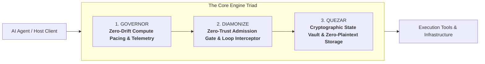

# Maxion MCP Runtime Gateway

> **Zero-drift compute pacing, zero-trust admission control, and cryptographic state vaulting for AI agent environments.**



---

## The Core Engine Triad

### 1. Governor
*Zero-Drift Compute Pacing & Telemetry*

The Governor regulates agent workload cadence in real time. Across diverse host architectures—from bare-metal servers to virtualized cloud instances and containerized environments—the Governor continuously balances execution thread duty cycles against available host capacity without human intervention.

* **Autonomous Operational Equilibrium**: Dynamically modulates execution pacing to sustain peak throughput.
* **Non-Invasive Architecture**: Operates silently with `< 0.05% CPU` self-consumption.
* **Universal Hardware Adaptation**: Calibrates instantly across cloud VMs, local machines, and enterprise server clusters.

---

### 2. Diamonize
*System-Wide Zero-Trust Admission & Threat Interceptor*

Diamonize enforces strict, fail-closed admission control across the entire execution surface. Every incoming payload, tool invocation, and state transition is inspected before reaching execution. Diamonize neutralizes prompt injection attempts, detects malformed inputs, and immediately severs runaway recursive loops and deadlock conditions.

* **Fail-Closed Admission**: Disallows unauthorized execution vectors and unverified payloads at the gate.
* **Runaway Loop Termination**: Automatically breaks execution spirals, infinite loops, and thread starvation.
* **Payload Neutralization**: Quarantines prompt injection patterns and unauthorized capability escalation.

---

### 3. Quezar
*Cryptographic State & Storage Vault*

Quezar guarantees absolute data confidentiality across the agent lifecycle. By enforcing a strict zero-plaintext-to-disk architecture, Quezar secures conversation memories, tool results, tokens, and active runtime context into hardware-accelerated encrypted envelopes.

* **Zero Plaintext to Disk**: Complete cryptographic sealing of ephemeral state, caches, and persistent memory.
* **Hardware-Accelerated Vaulting**: Sub-millisecond envelope encryption and retrieval.
* **Confidential Runtime Isolation**: Prevents unauthorized process inspection, memory dumps, and data leakage.

---

## Operational Specifications

| Feature | Specification | Architecture Standard |
| :--- | :--- | :--- |
| **Pipeline Lookup Latency** | `< 1.2 µs` | Zero-Overhead Interception |
| **Triad Composition** | 3 Synchronized Engines | Governor → Diamonize → Quezar |
| **Security Posture** | Fail-Closed Zero Trust | Strict Binary Admission |
| **State Storage** | Fully Sealed at Rest & In Flight | Zero Plaintext Exposure |
| **Protocol Compliance** | Model Context Protocol (MCP) | Universal RFC Specification |
| **Tooling Surface** | 35 Verified Primitives | Modular Tooling Architecture |

---

## Quick Configuration

Connect your host agent to Maxion via standard `mcp_config.json`:

```json
{
  "mcpServers": {
    "maxion": {
      "command": "node",
      "args": ["dist/index.js"],
      "env": {
        "MAXION_MODE": "production",
        "GOVERNOR_PACING": "adaptive",
        "DIAMONIZE_ENFORCE": "true",
        "QUEZAR_VAULT": "active"
      }
    }
  }
}
```

---

## Documentation Index

Deep dive into the architecture, engines, and enterprise governance:

* [Architecture](./Architecture.md) — End-to-end 3-engine pipeline execution and protocol mediation
* [Diamonize](./Diamonize.md) — Zero-trust admission rules, prompt defense, and loop termination
* [Quezar](./Quezar.md) — Cryptographic state vaulting and confidential storage architecture
* [Roadmap](./Roadmap.md) — Development milestones, v1.0 stability, and multi-tenant fleet governance
